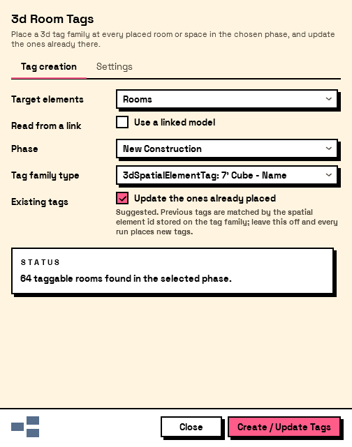
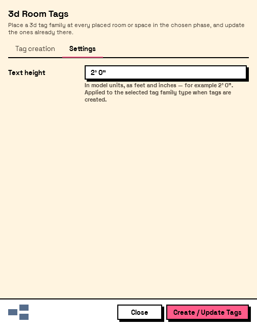

# 3D Spatial Tags for Revit

**Room and space tags you can actually see in 3D.** Revit's native tags only exist in plan, so a
coordination model, a walkthrough or an axon has nothing in it that says which room is which. This
add-in places a 3D tag family — name and number as model geometry — at every placed room or space,
and keeps them up to date as the model moves.

[](https://www.autodesk.com/products/revit/overview)
[](https://www.gnu.org/licenses/gpl-3.0)
[](https://github.com/johnpierson/3dSpatialTags/releases/latest)

<p align="center">
  
  &nbsp;
  
</p>

> ⚠️ **Use at your own risk.** This software is provided "as is", without warranty of any kind,
> express or implied. The developer is not responsible for any data loss or issues caused by the use
> of this plugin. It writes to your model inside a transaction — try it on a detached copy first.

---

## What it does

| | |
|---|---|
| **Rooms or spaces** | Tag either, from the same dialog. |
| **Linked models** | Read spatial elements out of a Revit link and place the tags in the host, transformed into place. |
| **Phase aware** | Only the rooms in the phase you pick. |
| **Updates in place** | Re-run it and existing tags follow their room's new name, number and location, rather than piling up duplicates. |
| **Configurable text height** | Set in feet and inches, applied to the tag family type. |
| **Revit 2020 – 2027** | One codebase, eight versions, across .NET Framework 4.8, .NET 8 and .NET 10. |

## Install

Grab the MSI from the [latest release](https://github.com/johnpierson/3dSpatialTags/releases/latest)
and run it. Two builds are published: **SingleUser**, which installs to your own `%AppData%`, and
**MultiUser**, which installs for everyone on the machine. The installer lists each supported Revit
version as a separate feature, so you can tick only the ones you want.

Restart Revit and look for **3d Spatial Tags** on the **design tech unraveled** ribbon panel.

## How it works

1. Open **3d Spatial Tags** from the ribbon.
2. Pick your **target** — Rooms or Spaces.
3. To tag a linked model, tick **use a linked model** and choose the link. (Select the link in the
   model before opening the dialog and it will be picked for you.)
4. Choose the **phase**.
5. Choose the **tag family type**.
6. Leave **update the ones already placed** ticked unless you want a fresh set every time.
7. **Create / Update Tags.**

The status card tells you how many elements the current selection would tag before you commit to
anything, and warns you about unbounded, redundant or unplaced ones — those cannot carry a tag.

### Notes and limits

- Rooms with a blank **name** or **number** are skipped. There would be nothing to put in the tag.
- Tags are matched back to their room by a `SpatialElementId` parameter stored on the tag family. A
  family without it cannot be used, and the tool will say so rather than placing blank tags.
- In a workshared model, a tag owned by another user is left alone and reported, not overwritten.
- Only spatial elements with a point location are tagged.

## Appearance

The dialog is drawn in the light theme from
[Interlude](https://github.com/johnpierson/Interlude): cream ground, heavy black outlines, hard
offset shadows, one hot-pink accent, set in Space Grotesk.

The palette, metrics and control styles live in
[`ThemesFolder/InterludeLight.xaml`](source/ThreeDeeRoomTags/ThemesFolder/InterludeLight.xaml) under
the same `Interlude.*` resource keys Interlude uses, so the two stay recognisably one design
language and a change over there is a search-and-replace over here. Interlude resolves those keys at
run time from a theme object; this add-in has one dialog and one appearance, so they are written out
directly. The font is embedded in the assembly, so the dialog looks the same on a machine that has
never installed it.

---

<details>
<summary><b>🛠 Technical details and build instructions</b></summary>

### Built with

- C# (latest language version)
- .NET Framework 4.8 — Revit 2020 – 2024
- .NET 8 — Revit 2025 – 2026
- .NET 10 — Revit 2027
- WPF / MVVM, with [CommunityToolkit.Mvvm](https://github.com/CommunityToolkit/dotnet)
- [Nice3point Revit API packages](https://github.com/Nice3point/RevitTemplates)
- [NUKE](https://nuke.build/) for the build and installer pipeline

### Prerequisites

- [.NET Framework 4.8 developer pack](https://dotnet.microsoft.com/download/dotnet-framework/net48)
- [.NET 8 SDK](https://dotnet.microsoft.com/en-us/download/dotnet/8.0)
- [.NET 10 SDK](https://dotnet.microsoft.com/en-us/download/dotnet/10.0)

### Building

JetBrains Rider or Visual Studio 2022, or the command line.

Configurations are named per Revit version — `Debug R26`, `Release R27` and so on. A **Debug** build
publishes straight into `%AppData%\Autodesk\Revit\Addins\<year>\`, so building is deploying:

```bash
dotnet build source/ThreeDeeRoomTags/ThreeDeeRoomTags.csproj -c "Debug R27"
```

For all versions plus the MSI installers and bundles:

```bash
dotnet tool install Nuke.GlobalTool --global
nuke                                    # build every Release configuration
nuke createinstaller                    # + MSI
nuke createinstaller createbundle       # + bundle
```

Adding support for a new Revit version means a configuration pair in
`source/ThreeDeeRoomTags/ThreeDeeRoomTags.csproj` (with the target framework that version's own
assemblies use) and the matching entries in `ThreeDeeRoomTags.sln` — the NUKE build globs `Release*`
over the solution's configurations.

### Spec-driven development

Behaviour changes are planned and tracked with
[OpenSpec](https://github.com/Fission-AI/OpenSpec). Current product requirements live in
`openspec/specs/`; proposed changes live in `openspec/changes/` until implementation and
verification are complete.

With Codex, start a change with `/opsx:propose <description>`, implement it with
`/opsx:apply <change-name>`, and finish with `/opsx:archive <change-name>`. See
[CONTRIBUTING.md](CONTRIBUTING.md) for the complete workflow and verification expectations.

### Solution structure

| Folder    | Description                                     |
|-----------|-------------------------------------------------|
| `build`   | NUKE build system configuration                 |
| `install` | WixSharp-based MSI installer projects           |
| `source`  | Add-in source code (ThreeDeeRoomTags)           |
| `revit`   | Source tag families, per Revit version          |
| `openspec`| Requirements and in-flight change proposals     |
| `output`  | Generated MSI bundles and installer files       |

### Project structure (`source/ThreeDeeRoomTags`)

| Folder                 | Description                                          |
|------------------------|------------------------------------------------------|
| `Classes`              | Global constants and shared helpers                  |
| `ThreeDeeRoomTagButton`| The command, model, view model and view              |
| `ThemesFolder`         | The Interlude light theme the dialog is drawn in     |
| `Fonts`                | Space Grotesk, embedded for the theme                |
| `Resources`            | Embedded assets and the bundled tag family           |
| `Utilities`            | String parsing and element helpers                   |

</details>

## License

This project is licensed under the **GNU General Public License v3 (GPLv3)**. See
[LICENSE](LICENSE) for details.

Space Grotesk, embedded in the add-in for the dialog, is licensed under the SIL Open Font License
1.1 — see
[`Fonts/SpaceGrotesk-OFL.txt`](source/ThreeDeeRoomTags/Fonts/SpaceGrotesk-OFL.txt).
